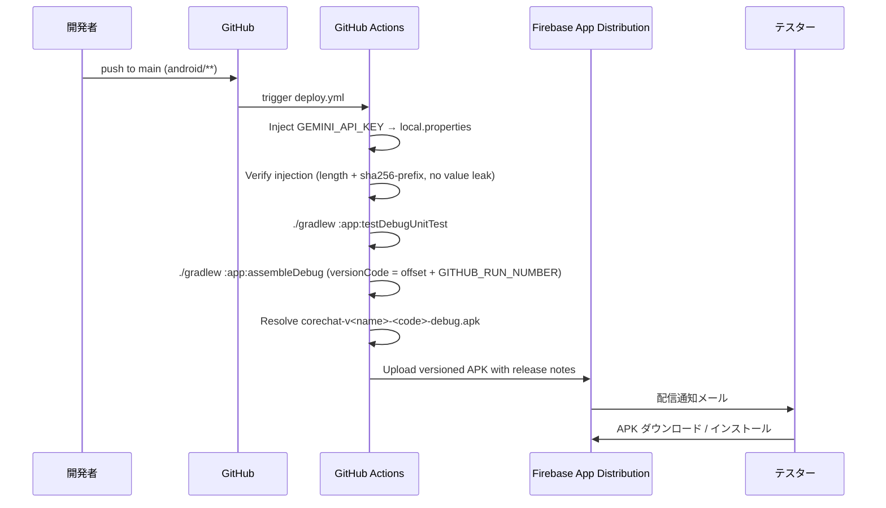

# CoreChat — セットアップガイド / Setup Guide

> AICore（Gemini Nano）を使ったオンデバイス AI チャットアプリの開発・配布セットアップ手順です。  
> This guide covers local development and Firebase App Distribution setup for CoreChat.

---

## 1. 前提 / Prerequisites

| 項目 / Item | 要件 / Requirement |
|---|---|
| Android Studio | Koala (2024.1) 以降 |
| JDK | 17 (Temurin 推奨) |
| Android SDK | compileSdk / targetSdk = API 35 (Android 15)。minSdk = API 31 (Android 12) ※AICore SDK の要件 |
| 実機（AICore 検証用） | Gemini Nano 対応端末（Pixel 8 Pro / 8a / 9 系、対応 Galaxy 等）。Android 14+ |
| エミュレータ | AICore 非対応。クラウドフォールバック経路での動作確認に利用 |
| Firebase プロジェクト | App Distribution 用に作成済み（Android アプリ登録で `applicationId = com.tsunaguba.corechat` を指定） |

> **Note:** 本アプリは Firebase **SDK**（Analytics / Auth / Firestore 等）を一切使用しません。Firebase は **App Distribution** による APK 配信のためだけに利用します。そのため `google-services.json` は不要です。

---

## 2. ローカル開発 / Local Development

```bash
git clone <this-repo>
cd pocket-brain-android-native/android
cp local.properties.template local.properties
# local.properties を編集して sdk.dir と GEMINI_API_KEY を設定
# Edit local.properties to set sdk.dir and GEMINI_API_KEY (optional: empty disables cloud fallback)

./gradlew :app:assembleDebug           # APK を app/build/outputs/apk/debug/ に生成
./gradlew :app:testDebugUnitTest       # ユニットテストを実行
```

`local.properties` は `.gitignore` 対象です。絶対にコミットしないでください。  
`local.properties` is git-ignored. **Never commit it.**

### 2.1 Gradle Wrapper

`gradle/wrapper/gradle-wrapper.jar` は Gradle 8.10.2 公式版をコミット済みです。破損や差し替えが必要な場合は以下で再生成できます。

```bash
cd android
# システム Gradle がインストールされている場合
gradle wrapper --gradle-version 8.10.2 --distribution-type bin
```

---

## 3. GitHub Secrets 登録（配信用） / Register GitHub Secrets

リポジトリの **Settings → Secrets and variables → Actions → New repository secret** で以下を登録します。

| Secret 名 | 必須 | 用途 / Purpose | 取得方法 |
|---|:---:|---|---|
| `FIREBASE_APP_ID` | 必須 | Firebase App Distribution のアプリ ID | Firebase コンソール → プロジェクト設定 → 一般 → Android アプリ → アプリ ID（`1:xxxx:android:yyyy`） |
| `FIREBASE_SERVICE_ACCOUNT_JSON` | 必須 | Firebase 認証（サービスアカウント JSON 全文） | GCP コンソールでサービスアカウント作成 → ロール `Firebase App Distribution Admin` 付与 → キー作成（JSON）して**ファイル内容全文**を貼り付け |
| `TESTERS_EMAILS` | ※ | 配布対象テスターのメールアドレス（カンマ区切り） | 例: `alice@example.com,bob@example.com`。**Firebase 側での事前登録は不要**（初回配信時に招待メールが自動送信）|
| `TESTER_GROUPS` | ※ | 配布対象テスターグループのエイリアス（カンマ区切り） | 例: `internal-testers`。**Firebase コンソールで事前にグループ作成必須**（未作成のエイリアスを渡すと `404 Requested entity was not found` で失敗）|
| `GEMINI_API_KEY` | 任意 | クラウドフォールバック用 Gemini API キー | https://aistudio.google.com/app/apikey 未設定の場合は AICore 対応端末のみで動作 |
| `DEBUG_KEYSTORE_B64` | 必須 | CI ビルドの debug 署名鍵（base64 エンコード）。全 CI ビルド間で証明書 SHA-1 を一定に保ち、テスター端末が上書きインストール可能になる。詳細は §3.2 | §3.2 の手順で生成 |
| `DEBUG_KEYSTORE_PASSWORD` | 任意（既定 `android`） | keystore のストアパスワード | §3.2 の手順と合わせて設定 |
| `DEBUG_KEY_ALIAS` | 任意（既定 `androiddebugkey`） | 鍵エイリアス | §3.2 の手順と合わせて設定 |
| `DEBUG_KEY_PASSWORD` | 任意（既定 `android`） | 鍵自体のパスワード | §3.2 の手順と合わせて設定 |

> ※ `TESTERS_EMAILS` と `TESTER_GROUPS` は**少なくとも片方**を設定してください。両方空の場合は Preflight step で early-fail します。
>
> **認証方式:** Firebase CLI トークン (`firebase login:ci`) は 2024 年以降 deprecated のため採用していません。サービスアカウント JSON 方式のみサポートします。  
> Firebase CLI tokens are deprecated; this project uses service account JSON only.

### 3.0 テスター配布先の選び方 / Tester Routing

| 方式 | 前準備 | 長所 | 短所 |
|---|---|---|---|
| **個別メール** (`TESTERS_EMAILS`) | Firebase 側で**不要**（初回配信で自動招待メール送信）| セットアップが最小、すぐ配信可能 | テスター追加／削除のたびに Secret を更新 |
| **グループ** (`TESTER_GROUPS`) | Firebase コンソールで「App Distribution → Testers & Groups → Add group」でエイリアス作成必須 | グループ側でメンバー管理できるため Secret 更新不要 | コンソール設定が必要、未作成だと 404 で失敗 |

**初期設定のおすすめ:** まず `TESTERS_EMAILS` だけで開始し、テスター数が 3 名を超えたタイミングで `TESTER_GROUPS` へ移行。

### 3.1 ⚠️ `GEMINI_API_KEY` の取扱い上の注意 / API Key Risk Notes

`GEMINI_API_KEY` はビルド時に `BuildConfig` に埋め込まれ、**APK 内に平文で配置されます**。APK をインストールしたテスターは `apktool` 等で抽出可能です。以下を必ず守ってください。

1. **配布範囲を社内テスター限定に保つ**（`internal-testers` 等のクローズドグループのみ）。公開配布は行わない
2. **AI Studio でキー制限を設定する**: API 制限 = `Generative Language API` のみに絞る。アプリ制限（Android 用パッケージ署名）も推奨
3. **キー漏洩が疑われた場合は即座に revoke**: AI Studio → API キー → 削除。別キーを発行し直して Secret を更新
4. **キーローテーション**: 四半期ごとの定期ローテーションを推奨
5. **本番ユーザー配布へ移行する際は BFF (Backend-for-Frontend) 経由に切替**: クライアント直接のクラウド API コールは廃止し、認証済みサーバ経由へ

> **Security Note**: `GEMINI_API_KEY` is embedded in the APK via BuildConfig in plain text. Anyone with the APK can extract it via `apktool`. Keep distribution to internal testers only, restrict the key in AI Studio, and revoke/rotate if compromised. For consumer distribution, move to a backend proxy instead.

### 3.2 Debug 署名鍵の共有 / Shared Debug Keystore

CI でビルドされる debug APK の**署名証明書を全ビルドで一致**させるため、固定の debug keystore を GitHub Secrets に保管します。これを行わないと、CI runner が毎回新しい `~/.android/debug.keystore` を自動生成し、証明書 SHA-1 が変わるため Android が `INSTALL_FAILED_UPDATE_INCOMPATIBLE` で更新を拒否します（テスターは毎回アンインストールが必要になる）。

#### 初回セットアップ手順（オペレーター、1 回のみ・PowerShell）

```powershell
# 1. キーストア生成。パスフレーズとエイリアスは AGP デフォルトと互換性を取るためそのまま
keytool -genkeypair -v `
  -keystore corechat-debug.keystore `
  -storepass android -keypass android `
  -alias androiddebugkey `
  -keyalg RSA -keysize 2048 -validity 8766 `
  -dname "CN=CoreChat Debug, OU=Dev, O=tsunaguba, L=NA, ST=NA, C=JP"

# 2. base64 変換（改行なし・BOM なし）
$bytes = [IO.File]::ReadAllBytes("corechat-debug.keystore")
[Convert]::ToBase64String($bytes) | Out-File -FilePath "corechat-debug.keystore.b64" -Encoding ascii -NoNewline

# 3.（任意）クリップボードにコピーして Secret 登録欄へ貼り付け
Get-Content "corechat-debug.keystore.b64" -Raw | Set-Clipboard
```

出力された base64 文字列を GitHub **Settings → Secrets and variables → Actions → New repository secret** に `DEBUG_KEYSTORE_B64` として登録します。パスワード・エイリアスをデフォルト（`android`/`androiddebugkey`/`android`）のままにする場合、他の 3 つの Secret は登録不要です（ワークフローが既定値にフォールバックします）。

> **なぜパスワードがデフォルト値か:** AGP の標準 debug keystore と互換性を保つため、パスワード・エイリアスは意図的にデフォルト値（`android` / `androiddebugkey`）を採用しています。debug 署名鍵の脅威モデルは「なりすまし debug APK の作成」のみで、これは Firebase App Distribution のクローズドな配信経路を前提にすれば低リスクです。カスタムパスワードにしたい場合は 4 つ全ての Secret を併せて登録してください。

#### ローカル開発者への配布

ローカルでも同じ署名を使う場合（ローカルビルドと CI ビルドを同じ端末に交互にインストールしたい場合のみ必要）、オペレーターから `corechat-debug.keystore` を受け取り `android/app/debug/corechat-debug.keystore` に配置します（`*.keystore` は `.gitignore` 済み）。配置しない場合でも AGP デフォルトの自動生成鍵で `./gradlew assembleDebug` は通ります（fail-open）。

検証コマンド（PowerShell）:

```powershell
cd android
.\gradlew.bat :app:printDebugCertFingerprint
```

出力された SHA-1 が CI ログの「Verify APK signing certificate fingerprint」ステップの SHA-1 と一致すれば、ローカル版と CI 版の証明書が同一であることが確認できます。

---

## 4. 配信フロー / Distribution Flow



- **トリガー:** `main` ブランチの `android/**` または `.github/workflows/deploy.yml` への push、または `workflow_dispatch` 手動起動
- **パス絞り込み:** 他のリポジトリ変更では走りません
- **Concurrency (後勝ち):** 短時間で複数 push が来た場合、先行の run は `cancel-in-progress: true` により**アップロード中でもキャンセル**されます。Firebase 側には中途半端な APK は残りません（wzieba は atomic POST）が、**テスターに 2 通メール（古い方のキャンセル通知＋新しい方の配信通知）が届く可能性**があります
- **テスト & Lint:** `:app:testDebugUnitTest` と `:app:lintDebug` が失敗するとビルド・配信は走りません
- **Artifact 保全:** ビルドされた `corechat-v<versionName>-<versionCode>-debug.apk` と Lint レポートは GitHub Actions Artifact として 30 日 / 14 日保持されます（Firebase 障害時のバックアップ経路）
- **Preflight:** `FIREBASE_APP_ID` / `FIREBASE_SERVICE_ACCOUNT_JSON` が未設定の場合はビルド開始前に失敗します（§3 のセットアップを促すエラーメッセージ）
- **GEMINI_API_KEY 検証:** Inject ステップ直後に `local.properties` への書込を検証し、キー長と sha256 の先頭 12 文字（値そのものは出力しない）をログに出します。空・短すぎる場合は警告を出すので、「AI利用不可」が出たら Actions ログで該当ステップを確認してください

手動トリガー時には任意のリリースノート文字列を渡せます（入力欄 `release_notes`）。

---

## 4.1 バージョン管理 / Version Management

**SoT:** `android/version.properties`

| プロパティ | 用途 |
|---|---|
| `versionName` | ユーザー向けセマンティックバージョン（例: `0.1.0`）。リリース毎に手動でバンプ |
| `versionCodeOffset` | CI ビルドの `versionCode` に加算されるオフセット。`versionCode = versionCodeOffset + GITHUB_RUN_NUMBER` |

**CI ビルドの versionCode 算出:**

```
versionCode = versionCodeOffset + GITHUB_RUN_NUMBER
```

`GITHUB_RUN_NUMBER` はワークフロー実行毎に単調増加するため、各 CI ビルドは**必ず前回より大きい** `versionCode` を得ます。これにより Android は新 APK を**アップグレードとして受け入れます**（同じ `versionCode` だと「アプリがインストールされていません」で拒否される）。

**ローカルビルドの versionCode 算出:**

```
versionCode = versionCodeOffset + 1
```

ローカル開発用は常に `versionCodeOffset + 1`。CI 由来の APK（`versionCode = offset + N`）より小さくなるため、同じ端末で CI 版を使いたい場合は一度アンインストールしてからローカル版を入れ直してください。

**APK ファイル名:**

```
corechat-v<versionName>-<versionCode>-<buildType>.apk
例: corechat-v0.1.0-42-debug.apk
```

バージョン毎にユニークなファイル名にすることで、Firebase App Distribution からダウンロードした APK がブラウザの重複リネーム（`(1)`, `(2)`）で識別できなくなる問題を防ぎます。

**リリース時のバンプ手順:**

1. `android/version.properties` の `versionName` を更新（例: `0.1.0` → `0.2.0`）
2. コミット & `main` への push
3. CI が新 `versionName` + 次の `GITHUB_RUN_NUMBER` で APK を生成
4. Firebase App Distribution が新ビルドとして配信

`versionCodeOffset` は通常触る必要はありません。例外的に、CI のカウンター外（手動ビルド等）で既に配布済みの `versionCode` を超える必要がある場合のみバンプします。

**署名証明書の固定化:** debug 署名鍵は §3.2 の `DEBUG_KEYSTORE_B64` Secret で固定化されています。CI ビルド間で APK の証明書 SHA-1 は常に一致するため、テスター端末は通常の上書きインストールで更新できます（初回切替時は §6 の `INSTALL_FAILED_UPDATE_INCOMPATIBLE` を参照）。

---

## 5. AICore 対応端末マトリクス / Device Matrix

| 端末 / Device | AICore | 挙動 / Behavior |
|---|:---:|---|
| Pixel 8 Pro | Yes | オンデバイス実行（"準備完了"）|
| Pixel 8a / 9 系 | Yes | オンデバイス実行 |
| Galaxy S24 / Z Fold6 | Yes | オンデバイス実行 |
| その他の Pixel / Android 14+ 端末 | No | クラウドフォールバック（"クラウドAI 準備完了"）|
| エミュレータ | No | クラウドフォールバック（"クラウドAI 準備完了"）|
| `GEMINI_API_KEY` 未設定の非対応端末 | No | 送信不可（"AI利用不可"）|

初回起動時、AICore が**数百 MB のモデルをバックグラウンドでダウンロードする**ため、Wi-Fi 接続を推奨します。進捗はステータスピルに表示されます。

---

## 6. トラブルシューティング / Troubleshooting

| 症状 / Symptom | 原因 / Cause | 対処 / Fix |
|---|---|---|
| 非対応端末で「AI利用不可」のまま | `GEMINI_API_KEY` が空 / 無効 / 短すぎる / ネットワーク不達 / モデル廃止 | debug ビルドでは「AIが利用できません」カード下部に原因別メッセージ（「APIキーが設定されていません」「APIキーの形式が不正」「APIキーが無効または権限不足」「ネットワークに接続できません」「AIサーバー応答遅延」「利用中のAIモデルが廃止されています」）+ 診断ブロック（キー長・SHA-256 先頭・プローブ結果）が表示されます。表示原因に応じて対処してください。**モデル廃止の場合は `CloudGeminiEngine.DEFAULT_MODEL` を [Gemini API models](https://ai.google.dev/gemini-api/docs/models) で現行の stable モデル名に更新（例: `gemini-1.5-flash` は 2025 年に shutdown 済みで `gemini-2.5-flash` 等へ移行）**。Secret を再設定した場合は CI ログの「Verify GEMINI_API_KEY injection」ステップで `length` と `sha256-prefix` を確認 |
| `INSTALL_FAILED_UPDATE_INCOMPATIBLE` / インストール時に「アプリがインストールされていません」 | 旧 APK と APK の**署名証明書**が異なる（§3.2 の Secret をローテーションした初回、または旧バージョン = 固定鍵導入前のビルドを既にインストールしている場合のみ発生） | 一度アンインストールしてから再インストール。`./gradlew :app:printDebugCertFingerprint` の出力と CI の「Verify APK signing certificate fingerprint」ログの SHA-1 を突き合わせて原因を特定。§3.2 で固定化済みなので通常の更新では再発しません |
| APK のインストール時に「アプリがインストールされていません」（versionCode 由来） | 旧 APK と同じ `versionCode` のビルドを当てている | `android/version.properties` の `versionCodeOffset` を確認。CI は `offset + GITHUB_RUN_NUMBER` で単調増加させるため通常問題になりません。ローカルビルドを CI 版の後に入れたい場合は一度アンインストール |
| ダウンロードした APK 名に `(1)` `(2)` が付く | 過去の配信と同じファイル名を使っている | 本リポジトリでは `corechat-v<versionName>-<versionCode>-<buildType>.apk` 形式にバージョン毎ユニーク化済み。古い `app-debug.apk` を削除してから再ダウンロード |
| Firebase アップロード `package name ... does not match` | `applicationId` が Firebase 登録アプリと不一致 | Firebase コンソール側のアプリの package が `com.tsunaguba.corechat` であることを確認 |
| Firebase 配信 `404 Requested entity was not found` | `TESTER_GROUPS` で指定したエイリアスが Firebase に未登録 | Firebase コンソール → App Distribution → Testers & Groups でグループ作成、または `TESTER_GROUPS` を空にして `TESTERS_EMAILS` で配布 |
| Preflight で `At least one of TESTER_GROUPS or TESTERS_EMAILS must be set` | 両方の Secret が空 | どちらかを設定（§3.0 参照） |
| Firebase アップロード `401 / 403` | サービスアカウントのロール不足 or Secret 未設定 | `FIREBASE_SERVICE_ACCOUNT_JSON` を設定し、`Firebase App Distribution Admin` ロールを付与 |
| AICore 初回ダウンロードが完了しない | ストレージ不足 / ネットワーク不安定 | Wi-Fi 接続、10GB 以上の空き確認 |
| `gradle wrapper --gradle-version` が失敗 | システム Gradle 未インストール | [Gradle 公式](https://gradle.org/install/) からインストール |

---

## 7. 参考 / References

- Firebase App Distribution: https://firebase.google.com/docs/app-distribution
- Google AI Edge (AICore) SDK: https://ai.google.dev/edge/generative-on-device/android
- Gemini API (cloud fallback): https://ai.google.dev/gemini-api/docs
- wzieba/Firebase-Distribution-Github-Action: https://github.com/wzieba/Firebase-Distribution-Github-Action
