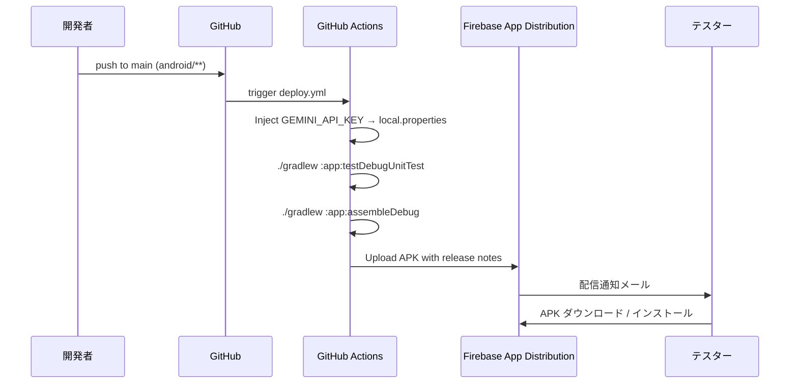

# CoreChat — セットアップガイド / Setup Guide

> AICore（Gemini Nano）を使ったオンデバイス AI チャットアプリの開発・配布セットアップ手順です。  
> This guide covers local development and Firebase App Distribution setup for CoreChat.

---

## 1. 前提 / Prerequisites

| 項目 / Item | 要件 / Requirement |
|---|---|
| Android Studio | Koala (2024.1) 以降 |
| JDK | 17 (Temurin 推奨) |
| Android SDK | compileSdk / targetSdk = API 35 (Android 15)。minSdk = API 31 (Android 12) ※AICore SDK の要件 |
| 実機（AICore 検証用） | Gemini Nano 対応端末（Pixel 8 Pro / 8a / 9 系、対応 Galaxy 等）。Android 14+ |
| エミュレータ | AICore 非対応。クラウドフォールバック経路での動作確認に利用 |
| Firebase プロジェクト | App Distribution 用に作成済み（Android アプリ登録で `applicationId = com.tsunaguba.corechat` を指定） |

> **Note:** 本アプリは Firebase **SDK**（Analytics / Auth / Firestore 等）を一切使用しません。Firebase は **App Distribution** による APK 配信のためだけに利用します。そのため `google-services.json` は不要です。

---

## 2. ローカル開発 / Local Development

```bash
git clone <this-repo>
cd pocket-brain-android-native/android
cp local.properties.template local.properties
# local.properties を編集して sdk.dir と GEMINI_API_KEY を設定
# Edit local.properties to set sdk.dir and GEMINI_API_KEY (optional: empty disables cloud fallback)

./gradlew :app:assembleDebug           # APK を app/build/outputs/apk/debug/ に生成
./gradlew :app:testDebugUnitTest       # ユニットテストを実行
```

`local.properties` は `.gitignore` 対象です。絶対にコミットしないでください。  
`local.properties` is git-ignored. **Never commit it.**

### 2.1 Gradle Wrapper

`gradle/wrapper/gradle-wrapper.jar` は Gradle 8.10.2 公式版をコミット済みです。破損や差し替えが必要な場合は以下で再生成できます。

```bash
cd android
# システム Gradle がインストールされている場合
gradle wrapper --gradle-version 8.10.2 --distribution-type bin
```

---

## 3. GitHub Secrets 登録（配信用） / Register GitHub Secrets

リポジトリの **Settings → Secrets and variables → Actions → New repository secret** で以下を登録します。

| Secret 名 | 必須 | 用途 / Purpose | 取得方法 |
|---|:---:|---|---|
| `FIREBASE_APP_ID` | 必須 | Firebase App Distribution のアプリ ID | Firebase コンソール → プロジェクト設定 → 一般 → Android アプリ → アプリ ID（`1:xxxx:android:yyyy`） |
| `FIREBASE_SERVICE_ACCOUNT_JSON` | 必須 | Firebase 認証（サービスアカウント JSON 全文） | GCP コンソールでサービスアカウント作成 → ロール `Firebase App Distribution Admin` 付与 → キー作成（JSON）して**ファイル内容全文**を貼り付け |
| `TESTERS_EMAILS` | 任意 | 配布対象テスターのメールアドレス（カンマ区切り） | 例: `alice@example.com,bob@example.com`。未指定時は `internal-testers` グループに配信 |
| `GEMINI_API_KEY` | 任意 | クラウドフォールバック用 Gemini API キー | https://aistudio.google.com/app/apikey 未設定の場合は AICore 対応端末のみで動作 |

> **認証方式:** Firebase CLI トークン (`firebase login:ci`) は 2024 年以降 deprecated のため採用していません。サービスアカウント JSON 方式のみサポートします。  
> Firebase CLI tokens are deprecated; this project uses service account JSON only.

### 3.1 ⚠️ `GEMINI_API_KEY` の取扱い上の注意 / API Key Risk Notes

`GEMINI_API_KEY` はビルド時に `BuildConfig` に埋め込まれ、**APK 内に平文で配置されます**。APK をインストールしたテスターは `apktool` 等で抽出可能です。以下を必ず守ってください。

1. **配布範囲を社内テスター限定に保つ**（`internal-testers` 等のクローズドグループのみ）。公開配布は行わない
2. **AI Studio でキー制限を設定する**: API 制限 = `Generative Language API` のみに絞る。アプリ制限（Android 用パッケージ署名）も推奨
3. **キー漏洩が疑われた場合は即座に revoke**: AI Studio → API キー → 削除。別キーを発行し直して Secret を更新
4. **キーローテーション**: 四半期ごとの定期ローテーションを推奨
5. **本番ユーザー配布へ移行する際は BFF (Backend-for-Frontend) 経由に切替**: クライアント直接のクラウド API コールは廃止し、認証済みサーバ経由へ

> **Security Note**: `GEMINI_API_KEY` is embedded in the APK via BuildConfig in plain text. Anyone with the APK can extract it via `apktool`. Keep distribution to internal testers only, restrict the key in AI Studio, and revoke/rotate if compromised. For consumer distribution, move to a backend proxy instead.

---

## 4. 配信フロー / Distribution Flow



- **トリガー:** `main` ブランチの `android/**` または `.github/workflows/deploy.yml` への push、または `workflow_dispatch` 手動起動
- **パス絞り込み:** 他のリポジトリ変更では走りません
- **Concurrency (後勝ち):** 短時間で複数 push が来た場合、先行の run は `cancel-in-progress: true` により**アップロード中でもキャンセル**されます。Firebase 側には中途半端な APK は残りません（wzieba は atomic POST）が、**テスターに 2 通メール（古い方のキャンセル通知＋新しい方の配信通知）が届く可能性**があります
- **テスト & Lint:** `:app:testDebugUnitTest` と `:app:lintDebug` が失敗するとビルド・配信は走りません
- **Artifact 保全:** ビルドされた `app-debug.apk` と Lint レポートは GitHub Actions Artifact として 30 日 / 14 日保持されます（Firebase 障害時のバックアップ経路）
- **Preflight:** `FIREBASE_APP_ID` / `FIREBASE_SERVICE_ACCOUNT_JSON` が未設定の場合はビルド開始前に失敗します（§3 のセットアップを促すエラーメッセージ）

手動トリガー時には任意のリリースノート文字列を渡せます（入力欄 `release_notes`）。

---

## 5. AICore 対応端末マトリクス / Device Matrix

| 端末 / Device | AICore | 挙動 / Behavior |
|---|:---:|---|
| Pixel 8 Pro | Yes | オンデバイス実行（"準備完了"）|
| Pixel 8a / 9 系 | Yes | オンデバイス実行 |
| Galaxy S24 / Z Fold6 | Yes | オンデバイス実行 |
| その他の Pixel / Android 14+ 端末 | No | クラウドフォールバック（"クラウド接続中"）|
| エミュレータ | No | クラウドフォールバック |
| `GEMINI_API_KEY` 未設定の非対応端末 | No | 送信不可（"AI利用不可"）|

初回起動時、AICore が**数百 MB のモデルをバックグラウンドでダウンロードする**ため、Wi-Fi 接続を推奨します。進捗はステータスピルに表示されます。

---

## 6. トラブルシューティング / Troubleshooting

| 症状 / Symptom | 原因 / Cause | 対処 / Fix |
|---|---|---|
| 非対応端末で「AI利用不可」のまま | `GEMINI_API_KEY` が空 | `local.properties` または GitHub Secret を設定 |
| Firebase アップロード失敗 `App ID does not match` | Firebase アプリ未登録 or applicationId 不一致 | Firebase コンソールで `com.tsunaguba.corechat` のアプリが存在するか確認 |
| Firebase アップロード `401 / 403` | サービスアカウントのロール不足 or Secret 未設定 | `FIREBASE_SERVICE_ACCOUNT_JSON` を設定し、`Firebase App Distribution Admin` ロールを付与 |
| AICore 初回ダウンロードが完了しない | ストレージ不足 / ネットワーク不安定 | Wi-Fi 接続、10GB 以上の空き確認 |
| `gradle wrapper --gradle-version` が失敗 | システム Gradle 未インストール | [Gradle 公式](https://gradle.org/install/) からインストール |

---

## 7. 参考 / References

- Firebase App Distribution: https://firebase.google.com/docs/app-distribution
- Google AI Edge (AICore) SDK: https://ai.google.dev/edge/generative-on-device/android
- Gemini API (cloud fallback): https://ai.google.dev/gemini-api/docs
- wzieba/Firebase-Distribution-Github-Action: https://github.com/wzieba/Firebase-Distribution-Github-Action
