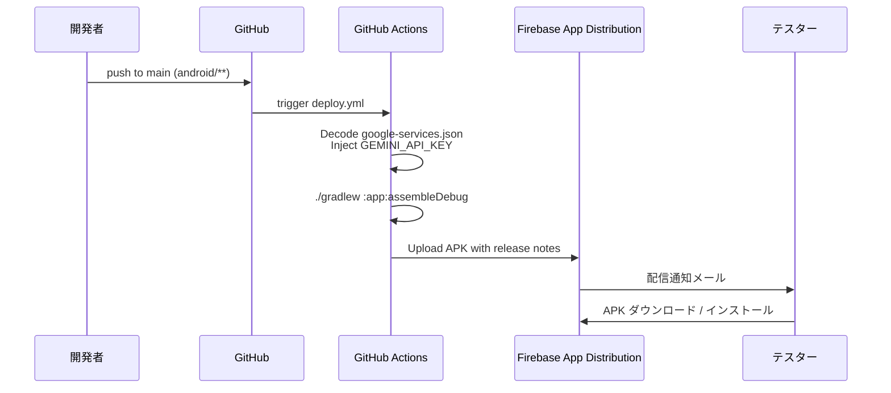

# CoreChat — セットアップガイド / Setup Guide

> AICore（Gemini Nano）を使ったオンデバイス AI チャットアプリの開発・配布セットアップ手順です。  
> This guide covers local development and Firebase App Distribution setup for CoreChat.

---

## 1. 前提 / Prerequisites

| 項目 / Item | 要件 / Requirement |
|---|---|
| Android Studio | Koala (2024.1) 以降 |
| JDK | 17 (Temurin 推奨) |
| Android SDK | API 35 (Android 15) インストール済み |
| 実機（AICore 検証用） | Gemini Nano 対応端末（Pixel 8 Pro / 8a / 9 系、対応 Galaxy 等）。Android 14+ |
| エミュレータ | AICore 非対応。クラウドフォールバック経路での動作確認に利用 |
| Firebase プロジェクト | 作成済み（Android アプリ登録で `applicationId = com.tsunaguba.corechat` を指定） |

---

## 2. ローカル開発 / Local Development

```bash
git clone <this-repo>
cd pocket-brain-android-native/android
cp local.properties.template local.properties
# local.properties を編集して sdk.dir と GEMINI_API_KEY を設定
# Edit local.properties to set sdk.dir and GEMINI_API_KEY

./gradlew :app:assembleDebug           # APK を app/build/outputs/apk/debug/ に生成
./gradlew :app:testDebugUnitTest       # ユニットテストを実行
```

`local.properties` と `app/google-services.json` は `.gitignore` 対象です。絶対にコミットしないでください。  
`local.properties` and `app/google-services.json` are git-ignored. **Never commit them.**

### 2.1 `google-services.json` をローカルに置く

1. Firebase コンソールで CoreChat 用 Android アプリを作成（`com.tsunaguba.corechat`）
2. `google-services.json` をダウンロード
3. `android/app/google-services.json` に配置（この場所は `.gitignore` 対象）

CI では GitHub Secret `GOOGLE_SERVICES_JSON_BASE64` から自動デコード配置されるため、ローカル配置は手元ビルド時のみ必要です。

### 2.2 Gradle Wrapper

`gradle/wrapper/gradle-wrapper.jar` は Gradle 8.10.2 公式版をコミット済みです。破損や差し替えが必要な場合は以下で再生成できます。

```bash
cd android
# システム Gradle がインストールされている場合
gradle wrapper --gradle-version 8.10.2 --distribution-type bin
```

---

## 3. GitHub Secrets 登録（配信用） / Register GitHub Secrets

リポジトリの **Settings → Secrets and variables → Actions → New repository secret** で以下 5 件を登録します。

| Secret 名 | 用途 / Purpose | 取得方法 |
|---|---|---|
| `FIREBASE_APP_ID` | Firebase App Distribution のアプリ ID | Firebase コンソール → プロジェクト設定 → 一般 → Android アプリ → アプリ ID（`1:xxxx:android:yyyy`） |
| `FIREBASE_SERVICE_ACCOUNT_JSON` | Firebase 認証（サービスアカウント JSON 全文） | GCP コンソールでサービスアカウント作成 → ロール `Firebase App Distribution Admin` 付与 → キー作成（JSON）して**ファイル内容全文**を貼り付け |
| `FIREBASE_TOKEN` | 代替認証（CI ユーザーのトークン）。サービスアカウントが使えない場合のみ | `firebase login:ci` コマンドで取得 |
| `GOOGLE_SERVICES_JSON_BASE64` | CI で `app/google-services.json` を復元するための Base64 文字列 | `base64 -i path/to/google-services.json \| tr -d '\n'` の出力を貼り付け |
| `TESTERS_EMAILS` | 配布対象テスターのメールアドレス（カンマ区切り） | 例: `alice@example.com,bob@example.com` |
| `GEMINI_API_KEY` | クラウドフォールバック用 Gemini API キー | https://aistudio.google.com/app/apikey |

> **推奨:** `FIREBASE_SERVICE_ACCOUNT_JSON` を使用してください。`FIREBASE_TOKEN` 方式は 2024 年以降 deprecated です。  
> Recommended: use `FIREBASE_SERVICE_ACCOUNT_JSON`. `firebase login:ci` tokens are being phased out.

---

## 4. 配信フロー / Distribution Flow



- **トリガー:** `main` ブランチの `android/**` または `.github/workflows/deploy.yml` への push、または `workflow_dispatch` 手動起動
- **パス絞り込み:** 他のリポジトリ変更では走りません
- **Concurrency:** 同一ブランチで重複実行されても古い実行は自動キャンセル

手動トリガー時には任意のリリースノート文字列を渡せます（入力欄 `release_notes`）。

---

## 5. AICore 対応端末マトリクス / Device Matrix

| 端末 / Device | AICore | 挙動 / Behavior |
|---|:---:|---|
| Pixel 8 Pro | Yes | オンデバイス実行（"準備完了"）|
| Pixel 8a / 9 系 | Yes | オンデバイス実行 |
| Galaxy S24 / Z Fold6 | Yes | オンデバイス実行 |
| その他の Pixel / Android 14+ 端末 | No | クラウドフォールバック（"クラウド接続中"）|
| エミュレータ | No | クラウドフォールバック |
| `GEMINI_API_KEY` 未設定の非対応端末 | No | 送信不可（"AI利用不可"）|

初回起動時、AICore が **数百 MB のモデルをバックグラウンドでダウンロードする**ため、Wi-Fi 接続を推奨します。進捗はステータスピルに表示されます。

---

## 6. トラブルシューティング / Troubleshooting

| 症状 / Symptom | 原因 / Cause | 対処 / Fix |
|---|---|---|
| ビルドで `google-services.json` 不在エラー | ローカルに配置していない | §2.1 を参照。または CI 経由でのみビルド |
| 非対応端末で「AI利用不可」のまま | `GEMINI_API_KEY` が空 | `local.properties` または GitHub Secret を設定 |
| Firebase アップロード失敗 `App ID does not match` | Firebase アプリ未登録 or applicationId 不一致 | Firebase コンソールで `com.tsunaguba.corechat` のアプリが存在するか確認 |
| AICore 初回ダウンロードが完了しない | ストレージ不足 / ネットワーク不安定 | Wi-Fi 接続、10GB 以上の空き確認 |
| `gradle wrapper --gradle-version` が失敗 | システム Gradle 未インストール | [Gradle 公式](https://gradle.org/install/) からインストール |

---

## 7. 参考 / References

- Firebase App Distribution: https://firebase.google.com/docs/app-distribution
- Google AI Edge (AICore) SDK: https://ai.google.dev/edge/generative-on-device/android
- Gemini API (cloud fallback): https://ai.google.dev/gemini-api/docs
- wzieba/Firebase-Distribution-Github-Action: https://github.com/wzieba/Firebase-Distribution-Github-Action
